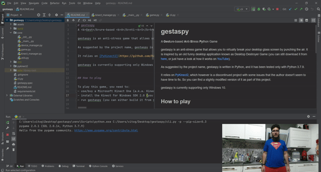

# gestaspy
A **Gest**ure-based **A**nti-**S**tress **Py**thon Game



gestaspy is an anti-stress game that allows you to virtually break your desktop glass screen by punching the air. It is inspired by an old funny desktop application known as Desktop Destroyer Game (you can still download it from [here](http://www.desktop-destroyer.net/), or just have a look at how it works on [YouTube](https://www.youtube.com/watch?v=_4723FREaiw)).

As suggested by the project name, gestaspy is written in Python, and it has been tested only with Python 3.7.9.

It relies on [PyKinect2](https://github.com/Kinect/PyKinect2), which however is a discontinued project with some issues that the author doesn't seem to have time to fix. So you can find a slightly modified version of it as part of this project.

gestaspy is currently supporting only Windows 10.


## How to play

To play this game, you need to:
- use/buy a Microsoft Kinect One (a.k.a. Kinect v2), along with its adapter for Windows
- install the Kinect for Windows SDK 2.0 (you can find it at [this link](https://www.microsoft.com/en-us/download/details.aspx?id=44561))
- run gestaspy. You have several options:
   - run it directly from source:
     ```
     python cli.py
     ```
   - build it from source using pyinstaller (see below)
   - download the last build from [here](https://github.com/VitoGentile/gestaspy/releases))


## How to build
1. Install [pyinstaller](http://www.pyinstaller.org/):
   ```
   pip install pyinstaller==3.5
   ```
   (note that using a different version of pyinstaller makes the resulting .exe being recognized as a malware by some AV, including MS Defender)
2. From the project root, run:
   ```
   pyinstaller gestaspy.spec --clean --name gestaspy --onefile
   ```


## Future work
There is a bunch of stuff to improve here, including:
- add support for other Kinect-like devices, such as Intel RealSense-based ones
- add support for 3D skeletal joint tracking based on RGB data (see for instance the [OpenPose](https://github.com/CMU-Perceptual-Computing-Lab/openpose) project)
- add some score within the game
- add support for different kinds of gestures and different kinds of actions to "break the desktop" :)
- add support for different OSs


## Anything else
I know, this project is missing a bunch of stuff, but it's just a weekend project that has been in my mind for years. So if you want to contribute or have fun with it, just [contact me](https://vitogentile.it/)!
